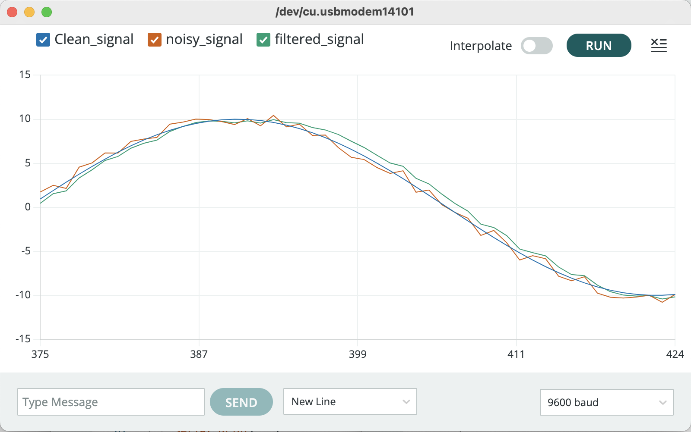

# 1euroFilter Arduino Library

Provides a library for the [1€ filter](https://gery.casiez.net/1euro/).

The 1€ filter ("one Euro filter") is a simple algorithm to filter noisy signals for high precision and responsiveness. It uses a first order low-pass filter with an adaptive cutoff frequency: at low speeds, a low cutoff stabilizes the signal by reducing jitter, but as speed increases, the cutoff is increased to reduce lag. The algorithm is easy to implement, uses very few resources, and with two easily understood parameters, it is easy to tune. In a comparison with other filters, the 1€ filter has less lag using a reference amount of jitter reduction. The 1€ filter is especially using to filter signals in interactive systems.

Visit the [1€ filter homepage](https://gery.casiez.net/1euro/) to know more and try the [on-line interactive version](https://gery.casiez.net/1euro/InteractiveDemo/).

## Minimal example

After installing the library, go in ```File > Examples > 1euroFilter > demo``` to get a demo.

```
#include "1euroFilter.h"

static OneEuroFilter f; // not enabled yet, setup has to be called later

// Frequency of your incoming noisy data
// If you are able to provide timestamps, the frequency is automatically determined
#define FREQUENCY   60   // [Hz] 
#define MINCUTOFF   3.0   // [Hz] needs to be tuned according to your application
#define BETA        0.1   // needs to be tuned according to your application

unsigned long start_time;

void setup() {
  // setup filter
  f.begin(FREQUENCY, MINCUTOFF, BETA);

  // initialize serial port
  Serial.begin(9600);

  start_time = micros();
}

void loop() {
  float elapsed_time = 1E-6 * (micros() - start_time); // in seconds
  float clean_signal = 10 * sin(elapsed_time * 6);
  
  long noise = random (-10, 10);
  float noisy_signal = clean_signal + noise / 10.0;

  float filtered_signal = f.filter(noisy_signal, elapsed_time) ;
  
  // The second parameter with timestamps can be omitted as following (FREQUENCY is then used)
  // float filtered_signal = f.filter(noisy_signal);

  // Frequency can also be adjusted at a later stage using setFrequency method
  // f.setFrequency(120);

  // MinCutoff can be adjusted using setMinCutoff method
  // For example a potentiometer can be connected to the arduino to adjust in real time its value
  // f.setMinCutoff(0.1);

  // Beta can be adjusted using setBeta method
  // For example a potentiometer can be connected to the arduino to adjust in real time its value
  // f.setBeta(0.001);

  // Printing data according to the format expected by Serial Plotter (go in Tools > Serial Plotter)
  Serial.print("Clean_signal:");
  Serial.print(clean_signal,3);
  Serial.print(",");
  Serial.print("noisy_signal:");
  Serial.print(noisy_signal,3);
  Serial.print(",");
  Serial.print("filtered_signal:");
  Serial.println(filtered_signal,3);

  // Pause during 15 ms (~60 Hz)
  delay(15);
}
```

Open Serial Plotter (Tools > Serial Plotter) to see the result of the filtering.



## Tuning the parameters
```MINCUTOFF``` and ```BETA``` are the two parameters to tune.

First set ```BETA``` to 0 and ```MINCUTOFF``` to a reasonable middle-ground value such as 1 Hz. Then the body part is held steady or moved at a very low speed while ```MINCUTOFF``` is adjusted to remove jitter and preserve an acceptable lag during these slow movements (decreasing ```MINCUTOFF``` reduces jitter but increases lag, ```MINCUTOFF``` must be > 0). Next, the body part is moved quickly in different directions while ```BETA``` is increased with a focus on minimizing lag. First find the right order of magnitude to tune ```BETA```, which depends on the kind of data you manipulate and their units: do not hesitate to start with values like 0.001 or 0.0001. You can first multiply and divide beta by factor 10 until you notice an effect on latency when moving quickly. Note that parameters fcmin and beta have clear conceptual relationships: if high speed lag is a problem, increase beta; if slow speed jitter is a problem, decrease ```MINCUTOFF```.

## Related publication

[](https://doi.org/10.1145/2207676.2208639)

```
@inproceedings{10.1145/2207676.2208639,
  author = {Casiez, G\'{e}ry and Roussel, Nicolas and Vogel, Daniel},
  title = {1 € Filter: A Simple Speed-Based Low-Pass Filter for Noisy Input in Interactive Systems},
  year = {2012},
  isbn = {9781450310154},
  publisher = {Association for Computing Machinery},
  address = {New York, NY, USA},
  url = {https://doi.org/10.1145/2207676.2208639},
  doi = {10.1145/2207676.2208639},
  pages = {2527–2530},
  numpages = {4},
  keywords = {noise, jitter, lag, precision, filtering, responsiveness, signal},
  location = {Austin, Texas, USA},
  series = {CHI '12}
}
```